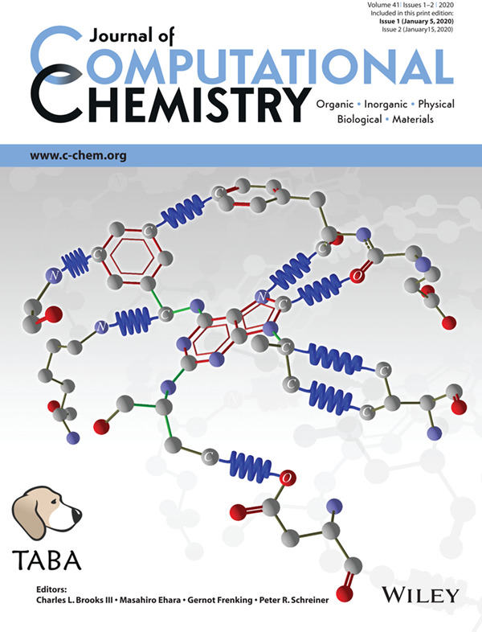

# Taba: Tool to Analyze Binding Affinity

<h4>Taba Citation</h4>

Please cite the following reference (<a href="https://www.ncbi.nlm.nih.gov/pubmed/31410856">da Silva AD et al., 2019</a>) if the Taba program was useful.

da Silva AD, Bitencourt-Ferreira G, de Azevedo WF Jr. Taba: A Tool to Analyze the Binding Affinity. J Comput Chem. 2019 <a href="https://doi.org/10.1002/jcc.26048">doi: 10.1002/jcc.26048</a>.   <a href="https://www.ncbi.nlm.nih.gov/pubmed/31410856">PubMed</a>  
 

Taba is free software: you can redistribute it and/or modify it under the terms of the <a href="https://www.gnu.org/licenses/gpl.txt">GNU General Public License</a> as published by the Free Software Foundation, either version 3 of the License, or (at your option) any later version. You can use a higher version as well.  

<h3>How to install Taba</h3>
You need to have Python 3.5 or 3.6 installed on your computer to run Taba. In addition, you also need NumPy (1.14.5*), Matplotlib, scikit-learn (0.19.1*), pyqt4 and SciPy (1.1.0*).  
*You can use a higher version as well.

<h4>Windows</h4>

Step 1. Download Taba (available here)

Step 2. Unzip the zipped file (TABA_dist)

Step 3. Copy TABA_dist directory to c:\

Step 4. Open a command prompt window (Terminal) and type: cd c:\TABA_dist

then type: python taba.py

This launches GUI window for Taba. That´s it, good Taba session. See help for additional information about how to run Taba.

<h4>Linux</h4>

Step 1. Download Taba (available here)

Step 2. Unzip the zipped file (TABA_dist)

Step 3. Copy TABA_dist directory to the directory of your choice 

Step 4. Open a terminal and type cd /your personal directory/TABA_dist

then type: python taba.py

This launches GUI window for Taba. That´s it, good Taba session. See help for additional information about how to run Taba.

Taba was developed by Amauri Duarte and Dr. Walter F. Azevedo Jr. (walter@azevedolab.net)

Taba site: www.taba.bio.br

Last update on September 7, 2018.

